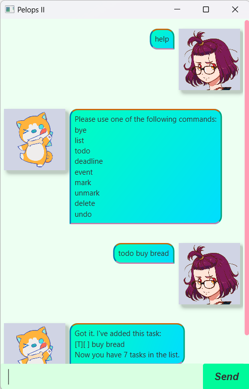

# Pelops II Chatbot User Guide



Welcome to **Pelops II**, your task management companion! 
This application helps you keep track of your _to-dos, deadlines, and events_ with ease.

- [Features](#features)
- [FAQ](#faq)

# Features
Command Quick Guide:
```
todo     | todo <description>
deadline | deadline <description> /by <date>
event    | event <description> /by event <description> /from <start_date> /to <end_date>
list     | list
mark     | mark <index>
unmark   | unmark <index>
delete   | delete <index>
undo     | undo
```
## Adding a todo task: ```todo```
Adds a todo task to the task list

Format: `todo <description>`

Examples:
 - `todo buy bread`
 - `todo wash dishes`

## Adding a deadline task: ```deadline```
Adds a deadline task to the task list

Format: `deadline <description> /by <date>`
- `<date>` must be in the format `YYYY-MM-DD hhmm`
- Enter time using the 24-hour format (hhmm). For example, 6:00 PM should be entered as 1800.

Examples:
 - `deadline assignment 1 /by 2025-03-25 2359`
 - `deadline XYZ marketing plan /by 2025-06-12 1700`

## Adding a event task: ```event```
Adds an event task to the task list

Format: `event <description> /from <start_date> /to <end_date>`
- `<start_date>` and `<end_date>` must be in the format `YYYY-MM-DD hhmm`
- Enter time using the 24-hour format (hhmm). For example, 6:00 PM should be entered as 1800.
- The `<start_date>` for the event must come before the `<end_date>`

Examples:
 - `event John's Birthday Party /from 2025-02-24 1600 /to 2025-02-24 2030`
 - `event Flag Day /from 2025-01-15 1200 /to 2025-01-18 1830`

## Listing all tasks: ```list```
Lists out all the tasks in the task list

Format: `list`

Example Output:
```
1. [D][ ] buy tickets (by: 24 Feb 2025 11:40PM)
2. [E][ ] birthday party (from: 23 Jan 2025 4:00PM to: 23 Jan 2025 10:00PM)
3. [T][ ] do homework
```

## Marking a task: ```mark```
Marks a task in the task list as completed

Format: `mark <index>`
- The `<index>` of a task can been seen from doing the `list` command
- `<index>` must be a number between 1 and the total number of items in the task list
 
Example:
- `mark 1`

Example output:
```
Nice! I've marked this task as done:
[D][X] buy tickets (by: 24 Feb 2025 11:40PM)
```

## Unmarking a task: ```unmark```
Unmarks a task in the task list as uncompleted

Format: `unmark <index>`
- The `<index>` of a task can been seen from doing the `list` command
- `<index>` must be a number between 1 and the total number of items in the task list
 
Example:
- `unmark 1`

Example output:
```
Ok, I've marked this task as not done yet:
[D][ ] buy tickets (by: 24 Feb 2025 11:40PM)
```

## Deleting a task: ```delete```
Deletes a task from the task list

Format: `delete <index>`
- The `<index>` of a task can been seen from doing the `list` command
- `<index>` must be a number between 1 and the total number of items in the task list
 
Example:
- `delete 1`

Example output:
```
Noted. I've removed this task:
[D][ ] buy tickets (by: 24 Feb 2025 11:40PM)
```

## Undoing a command: ```undo```
Undoes the previous command

Format: `undo`
- Undo only works on the following commands: `todo`, `deadline`, `event`, `mark`, `unmark`, `delete` and `undo`
- Undo only works on the previous undoable command
 
Example:
- `undo`

Example output:
```
Reverted previous command:
delete 1

Your Updated Task List:
1. [D][ ] buy tickets (by: 24 Feb 2025 11:40PM)
2. [E][ ] birthday party (from: 23 Jan 2025 4:00PM to: 23 Jan 2025 10:00PM)
3. [T][ ] do homework
```

# FAQ
**Q1:** Are commands case sensitive?

**Ans:** No commands are not case sensitive. `list` and `LiSt` will both recognized by Pelops II

**Q2:** Do I need to save my data in my task list?

**Ans:** Task list data are saved in your local storage automatically after any command that changes the data. There is no need to save the data manually.

**Q3:** What if I type in an invalid command?

**Ans:** Pelops II will prompt you will the list of available commands for you to use.

# Note
This task management companion is inspired by [Pelops II](https://wikizilla.org/wiki/Pelops_II) from [Godzilla Singular Point](https://godzilla.fandom.com/wiki/Godzilla_Singular_Point).